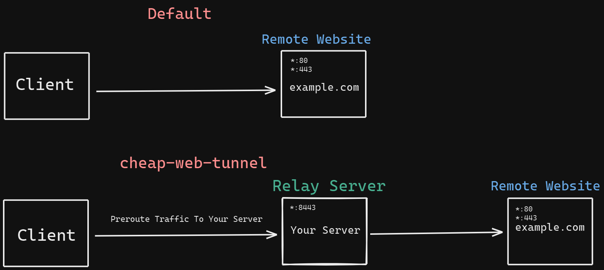

# Cheap Web Tunnel

Transmit your web traffic over your own server with the lowest CPU cost.  
This system requires router side firewall configuration and server-side container.

For some reason, sometimes you want to transmit your web traffic over a remote server. To solve this in general you will use a proxy or VPN applications on the client. If your device does not support proxy or VPN (such as TV) or you want to forward all home traffic over your remote server, you can use this kind of solution on the router side but this creates high CPU usage at your router and also the connection does not have good speed when we compare to native connection speed.  
Tunnelling protocols (GRE, GENEVE) are good at performance but if the connection is over Carrier-Grade NAT (CGN), tunnelling services cannot work.



## How it works ?

On the client-side, with the iptables, your router is prerouting connections which they destination port 80 and 443 to your remote server IP and Port instead of actual IP and Port.

## Server Side Setup

The system requires just only one free port for both HTTP and HTTPS traffic on the server-side. After dedicating a server port run the docker command to start the server ready to forward remote traffic.

This system has a few options you can configure. These configurations are set by an environment variable.

- nameserver  
Set nameserver for service.  
By default nameserver is `1.1.1.1`

- resolver_valid  
Replace DNS TTL value

- port  
Service listen port. It is good to use for native IPv6 or docker host network.

- client_addr
To allow only one ip address and block other addresses.

### Example Run

```bash
docker run -it --rm -p 8443:8443 ghcr.io/ahmetozer/cheap-web-tunnel:latest
```

## Client Side

Access your router terminal. Create firewall rules with iptables.

```bash
# Only forward one computer,tv or mobile device web traffic to your server
iptables -t nat -A PREROUTING -i ${lanInterface} -s ${lanClientIP} -p tcp  --dport ${destinationPort} -j DNAT --to-destination ${yourServerIP}:${serverPort}

# Example
iptables -t nat -A PREROUTING -i eth0 -s 192.168.2.96 -p tcp  --dport 443 -j DNAT --to-destination 198.51.100.54:8443
iptables -t nat -A PREROUTING -i eth0 -s 192.168.2.96 -p tcp  --dport 80 -j DNAT --to-destination 198.51.100.54:8443

# For all home traffic redirection, remove -s option.
iptables -t nat -A PREROUTING -i eth0 -p tcp  --dport 443 -j DNAT --to-destination 198.51.100.54:8443
iptables -t nat -A PREROUTING -i eth0 -p tcp  --dport 80 -j DNAT --to-destination 198.51.100.54:8443
```
